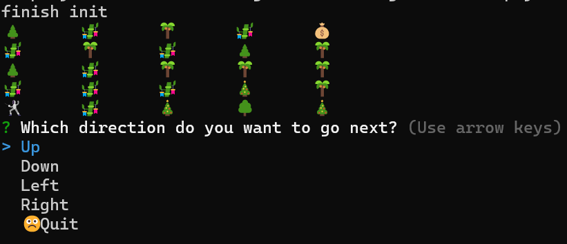
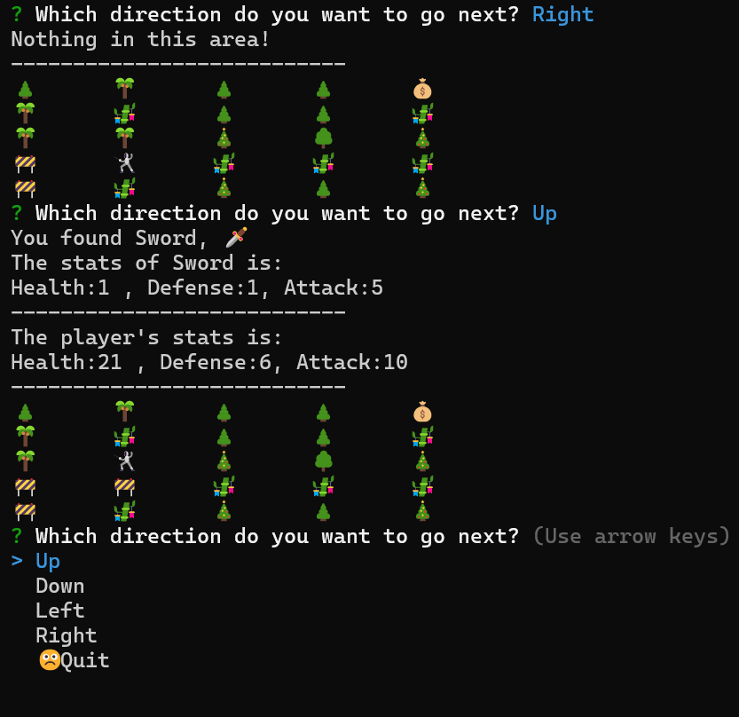
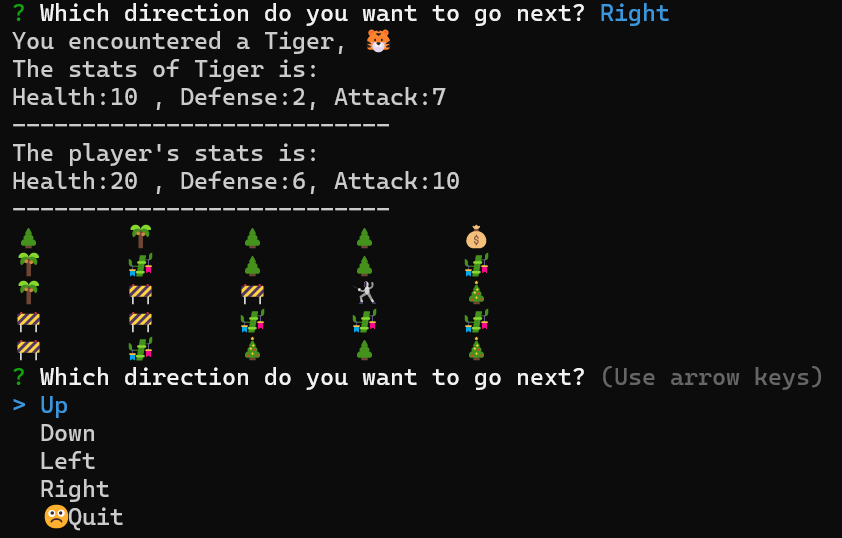
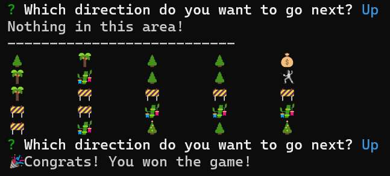

# Terminal-Game
Terminal command line adventure game using Javascript.

The game is simple, user can choose 4 driections by teminal prompt, and each turn can randomly run in to 
1. safe space
2. pick up a weapon
3. encounter enemy 

User will win when get to the final position with positive health left, otherwise loses the game.

# Start Game
<!-- Game default setting is starting with height 5 and width 5 grid -->
Run node Map.js
